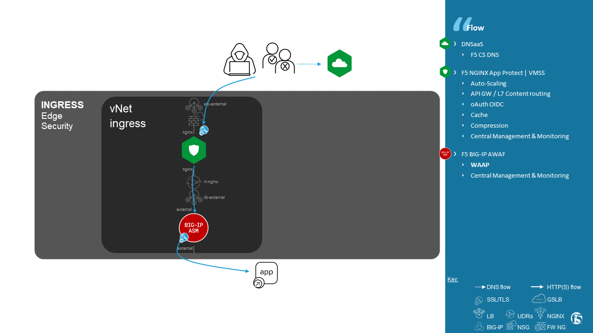
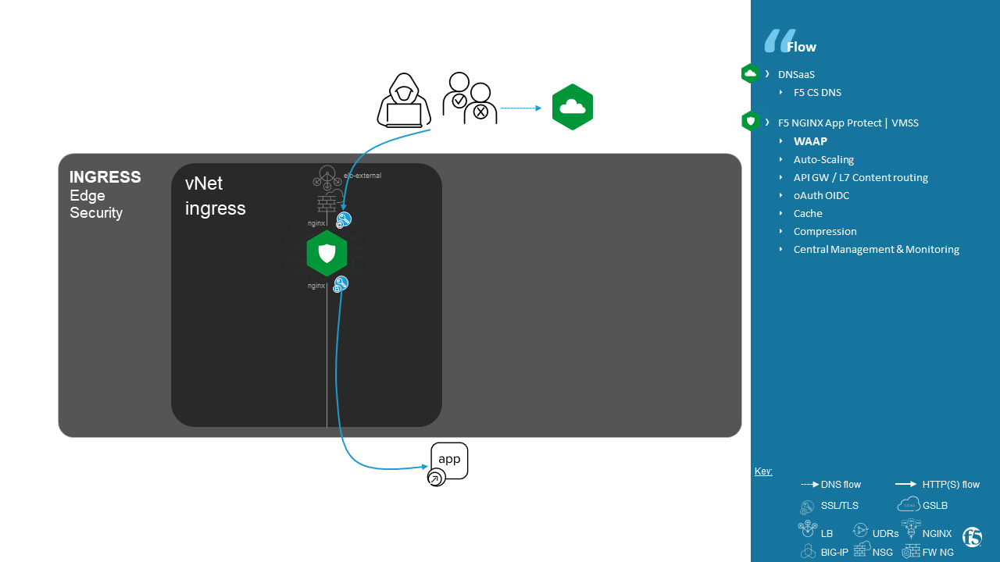
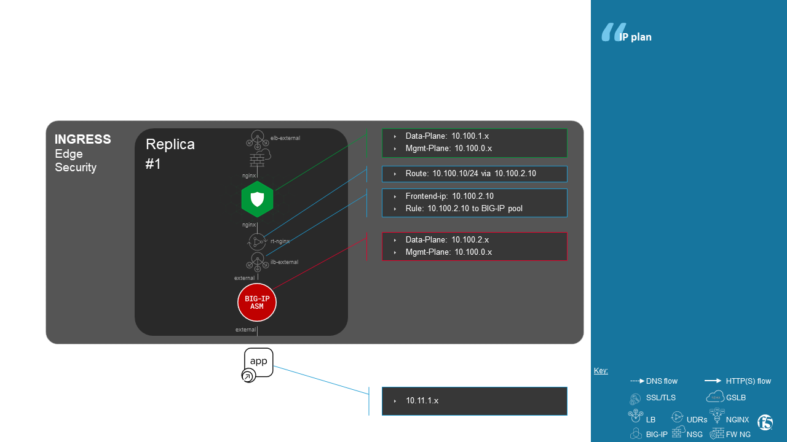

Deployment of an Active/Active BIG-IP synchronized cluster in Azure
###################################################################
.. contents:: Table of Contents

Architecture
*****************************************

.. contents:: Contents
    :local:

Ansible Role structure
**************
- Deployment is based on ``workflow template``. Example: ``workflow template``=``wf-create_create_edge_security_inbound`` ;
- A ``workflow template`` includes multiple ``job template``. Example: ``job template``=``poc-azure_create_hub_edge_security_inbound``
- A ``job template`` have an associated ``playbook``. Example: ``playbook``=``playbooks/poc-azure.yaml``
- A ``playbook`` launch a ``play`` in a ``role``. Example: ``role``=``poc-azure``

.. code:: yaml

    - hosts: localhost
      gather_facts: no
      roles:
        - role: poc-azure

- A ``play`` is an ``extra variable`` named ``activity`` and set in each ``job template``. Example: ``create_hub_edge_security_inbound``
- The specified ``play`` (or ``activity``) is launched by the ``main.yaml`` task located in the role ``tasks/main.yaml``

.. code:: yaml

    - name: Run specified activity
      include_tasks: "{{ activity }}.yaml"
      when: activity is defined

- The specified ``play`` contains ``tasks`` to execute. Example: play=``create_hub_edge_security_inbound.yaml``

Deployment
*****************************************

Azure infra
=========================================

Workflow template ``wf-create_create_edge_security_inbound``

=============================================================   =============================================       =============================================   =============================================   =============================================   =============================================
Job template                                                    objective                                           playbook                                        activity or play targeted in role               inventory                                       credential
=============================================================   =============================================       =============================================   =============================================   =============================================   =============================================
``poc-azure_create_hub_edge_security_inbound``                  Create a resource group and network objects         ``playbooks/poc-azure.yaml``                    ``create_hub_edge_security_inbound``            CMP_inv_CloudBuilderf5                          <Service Principal>
=============================================================   =============================================       =============================================   =============================================   =============================================   =============================================

==============================================  =============================================
Extra variable                                  Description
==============================================  =============================================
``extra_platform_name``                         logical platform name
``extra_platform_tags``                         tags on resources
``extra_location``                              region
``extra_vnet_address_prefixes``                 dataplane SuperNet
``extra_nginx_subnet_address_prefix``           NGINX dataplane subnet
``extra_external_subnet_address_prefix``        BIG-IP dataplane subnet
``extra_management_subnet_address_prefix``      Management subnet
``extra_subnet_mgt_on_premise``                 remote Cross management subnet
``extra_lb_external_vip``                       ILB frontendIP to load balance AWAF VMSS
``extra_vip_address_list_awaf``                 Subnet list to route via AWAF VMSS
==============================================  =============================================

.. code-block:: yaml

    extra_availability_zone:
      - 1
    extra_external_subnet_address_prefix: 10.100.2.0/24
    extra_lb_external_vip: 10.100.2.10
    extra_location: francecentral
    extra_management_subnet_address_prefix: 10.100.0.0/24
    extra_nginx_subnet_address_prefix: 10.100.1.0/24
    extra_platform_name: ingress
    extra_platform_tags: environment=POC platform=ingress project=customer_name
    extra_subnet_mgt_on_premise: 10.0.0.0/24
    extra_vip_address_list_awaf:
      - 10.100.10.0/24
    extra_vnet_address_prefixes: 10.100.0.0/16

NGINX App Protect managed by NGINX Controller
=============================================

Workflow template ``wf-create_managed_vmss_nginx_first_line``

=============================================================   =============================================       =============================================   =============================================   =============================================   =============================================
Job template                                                    objective                                           playbook                                        activity or play targeted in role               inventory                                       credential
=============================================================   =============================================       =============================================   =============================================   =============================================   =============================================
``poc-nginx_controller-create_instance-group_vmss``             Create Instance-group                               ``playbooks/poc-nginx_controller.yaml``         ``create_instance-group_vmss``                  localhost
``poc-azure_create-vmss-nginx-2NIC_1LB``                        Create VMSS                                         ``playbooks/poc-azure.yaml``                    ``create-vmss-nginx-2NIC_1LB``                  CMP_inv_CloudBuilderf5                          <Service Principal>
``poc-azure_create-vmss-extension-controller_agent``            Install NGINX using VMSS extension                  ``playbooks/poc-azure.yaml``                    ``create-vmss-extension-controller_agent``      CMP_inv_CloudBuilderf5                          <Service Principal>
``poc-azure_create-vmss-autoscale``                             Enable auto-scaling                                 ``playbooks/poc-azure.yaml``                    ``create-vmss-autoscale``                       CMP_inv_CloudBuilderf5                          <Service Principal>
=============================================================   =============================================       =============================================   =============================================   =============================================   =============================================

==============================================  =============================================
Extra variable                                  Description
==============================================  =============================================
``extra_location``                              region
``extra_availability_zone``                     list of Availability Zone IDs
``extra_platform_name``                         logical platform name
``extra_platform_tags``                         tags on resources
``extra_publisher``                             Editor name
``extra_offer``                                 OS distrib
``extra_sku``                                   OS distrib version
``extra_vm_size``                               VM type
``extra_vmss_capacity``                         initial vmss capacity
``extra_vmss_name``                             logical vmss name
``extra_image``                                 CentOS image version
``extra_key_data``                              admin certificate
``extra_subnet_dataplane_name``                 logical name for eth1 subnet
``extra_dataplane_subnet_address_mask``         eth1 (data-plane) subnet mask
``extra_gw_dataplane``                          eth1 (data-plane) GW
``extra_gw_management``                         eth0 (mgmt-plane) GW
``extra_route_prefix_on_premise``               cross management subnet
``extra_lb_dataplane_name``                     LB name for dataplane traffic
``extra_lb_dataplane_type``                     LB type for dataplane traffic
``extra_nginx_plus_version``                    NGINX version to install
``extra_managed_by``                            NGINX Controller or NGINX Instance Manager
``extra_nginx_controller_ip``                   NGINX Controller IP or FQDN
``extra_nginx_controller_password``             NGINX Controller user password
``extra_nginx_controller_username``             NGINX Controller username
==============================================  =============================================

.. code-block:: yaml

    extra_admin_password: Ch4ngeMe!
    extra_admin_user: admin
    extra_availability_zone: '[1, 2]'
    extra_dataplane_subnet_address_mask: 24
    extra_gw_dataplane: 10.100.1.1
    extra_gw_management: 10.100.0.1
    extra_image: 7.9.2021071901
    extra_key_data: -----BEGIN CERTIFICATE-----...-----END  CERTIFICATE-----
    extra_lb_dataplane_name: external
    extra_lb_dataplane_type: elb
    extra_location: francecentral
    extra_managed_by: nginx_controller
    extra_nginx_controller_ip: 10.0.0.6
    extra_nginx_controller_password: Ch4ngeMe!
    extra_nginx_controller_username: admin@admin.adm
    extra_nginx_plus_version: 25
    extra_offer: CentOS
    extra_platform_name: ingress
    extra_platform_tags: environment=POC platform=ingress project=customer_name
    extra_project_name: customer_name
    extra_publisher: OpenLogic
    extra_route_prefix_on_premise: 10.0.0.0/24
    extra_sku: 7_9-gen2
    extra_subnet_dataplane_name: nginx
    extra_vm_size: Standard_DS3_v2
    extra_vmss_capacity: 1
    extra_vmss_name: nap

BIG-IP managed by BIG-IQ
=============================================

Workflow template ``wf-create_vmss_device-group_awaf``

=============================================================   =============================================       =============================================   =============================================   =============================================   =============================================
Job template                                                    objective                                           playbook                                        activity or play targeted in role               inventory                                       credential
=============================================================   =============================================       =============================================   =============================================   =============================================   =============================================
``poc-azure_create-vmss-bigip``                                 Create VMSS                                         ``playbooks/poc-azure.yaml``                    ``create-vmss-bigip``                           CMP_inv_CloudBuilderf5                          <Service Principal>
``poc-azure_set-vmss-master_vm``                                Set a VM protected from ScaleIn                     ``playbooks/poc-azure.yaml``                    ``set-vmss-master_vm``                          CMP_inv_CloudBuilderf5                          <Service Principal>
``poc-azure_get-vmss-facts``                                    Get VMs IPs                                         ``playbooks/poc-azure.yaml``                    ``get-vmss-facts``                              CMP_inv_CloudBuilderf5                          <Service Principal>
``poc-f5_do_vmss_device-group``                                 Onboard BIG-IPs via BIG-IQ                          ``playbooks/poc-f5.yaml``                       ``do_vmss_device-group_bigiq``                  localhost
``poc-f5-as3_vmss_device-group_create_log_profile``             Create a log profile for Security event             ``playbooks/poc-f5.yaml``                       ``as3_vmss_device-group_bigiq_create_config``   localhost
=============================================================   =============================================       =============================================   =============================================   =============================================   =============================================

==============================================  ========================================================================
Extra variable                                  Description
==============================================  ========================================================================
``extra_bigiq_admin_password``                  BIG-IQ admin user name
``extra_bigiq_admin_user``                      BIG-IQ admin user password
``extra_bigiq_ip_mgt``                          BIG-IQ IP or FQDN
``extra_bigiq_port_mgt``                        BIG-IQ management port
``extra_dcd_ip``                                BIG-IQ lognode IP
``extra_dcd_port``                              BIG-IQ lognode port
``extra_dcd_servers``                           BIG-IQ lognode servers (Lab) or ILB VIP for ASM log (Production)
``extra_admin_user``                            BIG-IP admin user name
``extra_admin_password``                        BIG-IP admin user password
``extra_port_mgt``                              BIG-IP management port
``extra_template_do``                           BIG-IP Declarative Onboardig template to use
``extra_as3_template``                          BIG-IP Application Service template to deploy
``extra_platform_name``                         logical platform_name
``extra_platform_tags``                         resource tags to apply
``extra_project_name``                          logical project_name
``extra_location``                              Azure region
``extra_vmss_capacity``                         initial vmss_capacity
``extra_vmss_name``                             logical vmss_name
``extra_vm_size``                               VM type
``extra_availability_zone``                     availability zones
``extra_key_data``                              BIG-IP admin CRT
``extra_offer``                                 BIG-IP offer (BYOL)
``extra_sku``                                   BIG-IP version
``extra_elb_management_name``                   ELB for outbound connection (package download, live update, Shape...)
``extra_subnet_dataplane_name``                 logical name for eth1 subnet
``extra_dataplane_subnet_address_mask``         eth1 subnet mask
``extra_gw_dataplane``                          eth1 GW
``extra_gw_management``                         eth0 GW
``extra_route_prefix_on_premise``               cross management subnet
``extra_lb_dataplane_name``                     LB name for dataplane traffic
``extra_lb_dataplane_type``                     LB type for dataplane traffic
==============================================  ========================================================================

.. code-block:: yaml

    extra_admin_password: Ch4ngeMe!
    extra_admin_user: admin
    extra_as3_template: as3_security_logging.jinja2
    extra_availability_zone: '[1, 2]'
    extra_bigiq_admin_password: Ch4ngeMe!
    extra_bigiq_admin_user: adminUser
    extra_bigiq_device_discovery_state: present
    extra_bigiq_ip_mgt: 1.1.1.1
    extra_bigiq_port_mgt: 443
    extra_dataplane_subnet_address_mask: 24
    extra_dcd_ip: 10.0.0.5
    extra_dcd_port: 8514
    extra_dcd_servers: '[{''address'': ''10.0.0.5'', ''port'': ''8514''}]'
    extra_elb_management_name: outbound-management-vmss-awaf
    extra_gw_dataplane: 10.100.2.1
    extra_gw_management: 10.100.0.1
    extra_key_data: -----BEGIN CERTIFICATE-----...-----END  CERTIFICATE-----
    extra_lb_dataplane_name: external
    extra_lb_dataplane_type: ilb
    extra_location: francecentral
    extra_offer: f5-big-ip-byol
    extra_platform_name: ingress
    extra_platform_tags: environment=POC platform=ingress project=customer_name
    extra_port_mgt: 443
    extra_project_name: customer_name
    extra_route_prefix_on_premise: 10.0.0.0/24
    extra_sku: f5-big-all-1slot-byol
    extra_subnet_dataplane_name: external
    extra_template_do: do-vmss-standalone-2nic-awaf-BIGIQ.json
    extra_vm_size: Standard_DS3_v2
    extra_vmss_capacity: 2
    extra_vmss_name: bigipwaf

Create Spoke to host applications servers
=============================================

=============================================================   ================================================       =============================================   =============================================   =============================================   =============================================
Job template                                                    objective                                              playbook                                        activity or play targeted in role               inventory                                       credential
=============================================================   ================================================       =============================================   =============================================   =============================================   =============================================
``create-spoke-infra``                                          Create infra                                           ``playbooks/poc-azure.yaml``                    ``create_vmss_app``                             CMP_inv_CloudBuilderf5                          <Service Principal>
=============================================================   ================================================       =============================================   =============================================   =============================================   =============================================

==============================================  ========================================================================
Extra variable                                  Description
==============================================  ========================================================================
``extra_vnet_address_prefixes``                 SuperNet
``extra_management_subnet_address_prefix``      Management Plane of App servers
``extra_backbone_subnet_address_prefix``        Interconnection with a dedicated F5 Volterra Gateway
``extra_zone_subnet_address_prefix``            Data Plane of App servers
``extra_zone_name``                             Data Plane Security Zone name
``extra_hub_name``                              remote vNet peering
``extra_platform_name``                         logical platform_name
``extra_platform_tags``                         resource tags to apply
``extra_project_name``                          logical project_name
``extra_location``                              Azure region
``extra_subnet_mgt_on_premise``                 remote Cross Management subnet
==============================================  ========================================================================

.. code-block:: yaml

    extra_backbone_subnet_address_prefix: 10.11.3.0/24
    extra_hub_name: ingress
    extra_location: francecentral
    extra_management_subnet_address_prefix: 10.11.0.0/24
    extra_platform_name: app1
    extra_platform_tags: environment=POC platform=app1 project=customer_name
    extra_subnet_mgt_on_premise: 10.0.0.0/24
    extra_vnet_address_prefixes: 10.11.0.0/16
    extra_zone_name: app
    extra_zone_subnet_address_prefix: 10.11.1.0/24

Deploy application
=============================================

Workflow template ``wf-create-app_inbound_nginx_controller_letsencrypt``

=============================================================   ================================================       =============================================   =============================================   =============================================   =============================================
Job template                                                    objective                                              playbook                                        activity or play targeted in role               inventory                                       credential
=============================================================   ================================================       =============================================   =============================================   =============================================   =============================================
``poc-azure_create_vmss_app``                                   Create VMSS Application Arcadia                        ``playbooks/poc-azure.yaml``                    ``create_vmss_app``                             CMP_inv_CloudBuilderf5                          <Service Principal>
``poc-letsencrypt-get_certificate``                             Create an ACME challenge                               ``playbooks/poc-letsencrypt.yaml``              ``get_certificate``                             localhost
``poc-nginx_controller-create_gw_app_component_vmss_north``     Create an Application Service on NGINX                 ``playbooks/poc-nginx_controller.yaml``         ``create_gw_app_component_vmss_north``          localhost
``poc-azure_get-vmss-facts``                                    Get BIG-IP VMs IPs                                     ``playbooks/poc-azure.yaml``                    ``get-vmss-facts``                              CMP_inv_CloudBuilderf5                          <Service Principal>
``poc-f5-create_as3_app_inbound_awaf_device-group``             Create an Application Service on BIG-IP                ``playbooks/poc-f5.yaml``                       ``as3_vmss_device-group_bigiq_create``          localhost
``poc-letsencrypt-assert_crt``                                  Check if certificate is issued from LetsEncrypt        ``playbooks/poc-letsencrypt.yaml``              ``assert_crt``                                  localhost
``poc-nginx_controller-create_component_acme_challenge``        Publish ACME challenge                                 ``playbooks/poc-nginx_controller.yaml``         ``create_component_acme_challenge``             localhost
``poc-letsencrypt-get_certificate_bis``                         Validate ACME challenge then fetch certificate         ``playbooks/poc-letsencrypt.yaml``              ``get_certificate``                             localhost
``poc-nginx_controller-update_certificate``                     Update certificate                                     ``playbooks/poc-nginx_controller.yaml``         ``update_certificate``                          localhost
=============================================================   ================================================       =============================================   =============================================   =============================================   =============================================

==============================================  ========================================================================
Extra variable                                  Description
==============================================  ========================================================================
``extra_app``                                   NGINX Controller: Application Service input
``extra_waf_policy``                            BIG-IP: Source of Truth location of WAF policy
``extra_template``                              BIG-IP: Application Service template to use
``extra_app_backend``                           VM extension script used to deploy Application

==============================================  ========================================================================

.. code-block:: yaml

    extra_app:
      components:
        - name: north
          type: adc
          uri: /
          template: component_adc.json
          waf_policy: https://raw.githubusercontent.com/nergalex/f5-nap-policies/master/policy/arcadia.json
          workloads:
            - 'http://10.100.10.1'
      domain: f5cloudbuilder.dev
      environment: PROD
      monitor_uri: /
      name: app1
      vip_subnet_awaf:
        - 10.100.10.1
    extra_app_backend: arcadia_1nic_bootstrapping.jinja2
    extra_app_vm_size: Standard_B2s
    extra_bigip_target_admin_password: Ch4ngeMe!
    extra_bigip_target_admin_user: admin
    extra_bigip_target_port_mgt: 443
    extra_bigiq_admin_password: Ch4ngeMe!
    extra_bigiq_admin_user: admin
    extra_bigiq_ip_mgt: 1.1.1.1
    extra_bigiq_port_mgt: 443
    extra_compression: 'False'
    extra_hub_platform_name: ingress
    extra_hub_vmss_name: bigipwaf
    extra_key_data: -----BEGIN CERTIFICATE-----...-----END  CERTIFICATE-----
    extra_location: francecentral
    extra_log_profile: /Common/Shared/asm_log_bigiq
    extra_nginx_controller_ip: 2.2.2.2
    extra_nginx_controller_password: Ch4ngeMe!
    extra_nginx_controller_username: admin_user@admin.mgt
    extra_platform_name: ingress
    extra_platform_tags: environment=POC project=customer_name
    extra_project: customer_name
    extra_project_name: customer_name
    extra_spokeplatform_name: app1
    extra_template: as3_vmss_bigiq-http_waf.json
    extra_vlans: '[''/Common/external'']'
    extra_vmss_capacity: 2
    extra_vmss_name: app1
    extra_vmss_name_nginx_first_line: nap
    extra_vmss_name_nginx_second_line: nginxapigw
    extra_waf_policy: https://raw.githubusercontent.com/nergalex/f5-awaf-policies/master/policy/API_security_template.xml
    extra_zone_name: app

